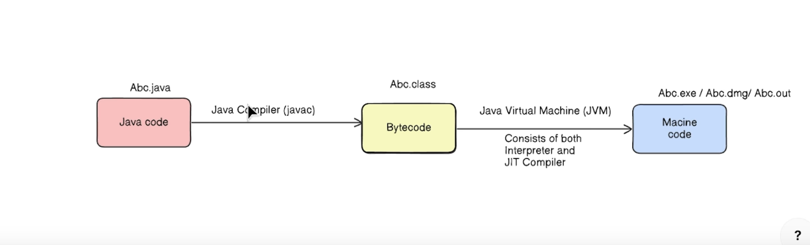
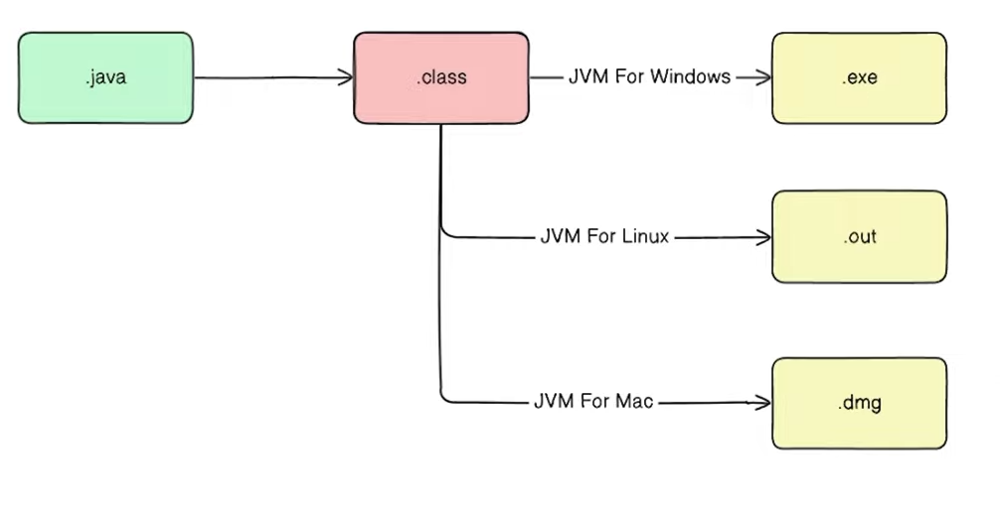
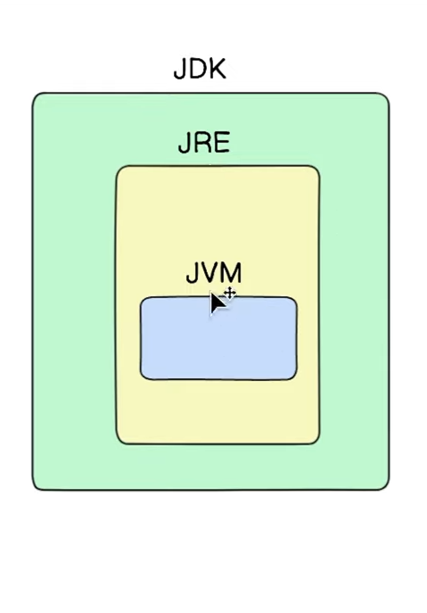
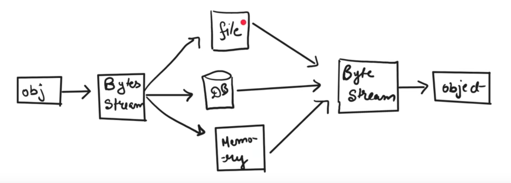
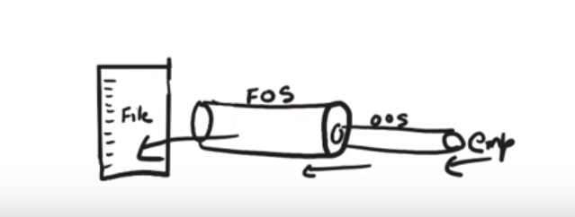
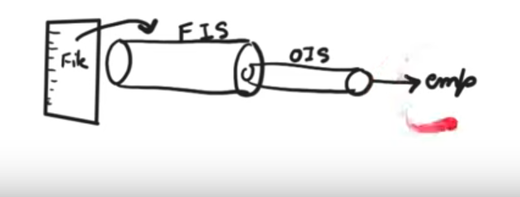

### Q) How is the Java code that you write executed on the machine/CPU?*
# Java Code Execution Process

This section provides an overview of how Java code is translated into machine-executable code on the CPU, detailing each step in the process.

## 1. Java Code to Bytecode
   - **Java Compiler (`javac`)**:  
     The Java code you write in human-readable format (in `.java` files) is first compiled by the Java compiler, invoked using the command `javac`. The compiler converts the source code into platform-independent bytecode, which is stored in `.class` files.
   - **Compilation Process**:  
     The `javac` compiler analyzes the Java source code and translates it into bytecode instructions. Each `.java` file corresponds to a `.class` file containing the bytecode.

## 2. Bytecode to Machine Code
   - **Java Virtual Machine (JVM)**:  
     The JVM is responsible for executing the compiled bytecode. It translates the bytecode into native machine code that the underlying hardware (CPU) can execute.
   
   ### Key Components of JVM Execution:
   - **Interpreter**:  
     Initially, the JVM uses an interpreter to execute bytecode. The interpreter processes each bytecode instruction one by one, allowing the program to start running quickly, albeit at a slower speed.
   
   - **Just-In-Time (JIT) Compiler**:  
     To improve performance, the JVM uses the JIT compiler to optimize frequently executed bytecode sections (known as "hot spots").
Hotspots are nothing but those portion which need optimisation which executes a lot that needs optimisation eg.a for loop consist of a sum of  million condition but with the help of JIT they are converted to natural number sum formula for easier execution.
These sections are compiled into native machine code for more efficient execution. 
   *Performance doesnot depends upon compiler it is depend upon running of bytecode to machine code. 
   - **Optimized Native Code Execution**:  
     Once the bytecode is converted into native machine code by the JIT compiler, the JVM directly executes the optimized native code on the CPU, similar to how native applications run on a machine.

## Summary
- The Java compiler (`javac`) translates the source code into platform-independent bytecode.
- The Java Virtual Machine (JVM) interprets and/or compiles the bytecode into native machine code.
- The JVM uses a combination of an interpreter and Just-In-Time (JIT) compiler for optimal performance, ensuring the bytecode is efficiently executed on the CPU.


**Credits :https://www.youtube.com/watch?v=G5a91WqNytI&t=1825s**

### Q) What is JVM?*
JVM stands for Java Virtual Machine it is a Java interpreter.It is responsible for loading,verifying and executing the bytecode created in Java.
Although it is platform dependent which means the software of JVM is diff for diffrent OS it plays a vital role in making Java platform independent.



### Q) Is Java Platform Independent if then how?*
Yes,Java is PI language.Unlike many programming language javac compiler compiles the program to form a bytecode or .class file.This file is independent of the software or hardware running but needs a JVM file preinstalled in the OS for further execution of the bytecode.
Athough JVM is platform dependent the bytecode can be created on any System and can be executed in any other system despite hardware or software being used which makes Java platform independent.
concise read here:https://www.scaler.com/topics/why-java-is-platform-independent/

### What is the purpose of the String[] args parameter?
The args parameter allows passing command -line argument to the main method when the program is executed.These arguments can be used to provide input or configuration to the program.

### Can there be mutiple main method in a class?
No there can only be one main method with the signature,public static ovid main(String[] args) in a Java class.It serves as the entry point for the program

## Can the main method be overloaded?
Yes the main method can be overloded like any other method in Java.However,only the public static main(String[] args) method is recognized as the entry point by the JVM.
change,type and order of arguments overloads main method
```java
public class MainExample {
    public static void main(String[] args) {
        System.out.println("Standard main method");
        // Call overloaded main methods
        main(5);
        main(args,"Hello");
    }

    // Overloaded main method with an int parameter
    public static void main(String[]args,int arg) {
        System.out.println("Overloaded main method with int: " + arg);
    }

    // Overloaded main method with a String parameter
    public static void main(String arg) {
        System.out.println("Overloaded main method with String: " + arg);
    }
}
```
##Difference between JDK,JRE and JVM?
# Understanding JDK, JRE, and JVM




## Purpose

- **JDK (Java Development Kit)**: Provides tools for developing Java applications, including compilers and debuggers.
- **JRE (Java Runtime Environment)**: Provides the runtime environment to execute Java applications. It includes the JVM and libraries necessary for running Java programs.
- **JVM (Java Virtual Machine)**: Executes Java bytecode and translates it into native machine code. It is responsible for running Java applications.

## Components

- **JDK**:
  - **JRE**: Includes JVM and libraries needed to run Java applications.
  - **Development Tools**: Includes tools like the Java compiler (`javac`), debugger, and other utilities for development.

- **JRE**:
  - **JVM**: The Java Virtual Machine.
  - **Libraries**: Provides the libraries and additional components needed for the runtime environment.

- **JVM**:
  - **Interpreter**: Executes bytecode instructions.
  - **JIT Compiler**: Compiles bytecode to native machine code at runtime for performance optimization.
  - **Garbage Collector**: Manages memory by reclaiming unused objects.
  - **Runtime Libraries**: Provides core libraries used during execution.

## Inclusions

- **JDK**: 
  - Includes the JRE (which includes libraries).
  - Development tools (compiler, debugger, etc.).
  - Libraries for development.

- **JRE**:
  - Includes libraries for the runtime environment.
  - Does not include development tools.

- **JVM**:
  - Does not include libraries or development tools.
  - It is built into the JRE.

## Installation

- **JDK**:
  - Installed separately for Java development and running Java applications.
  - Provides the full suite of development tools and runtime environment.

- **JRE**:
  - Installed separately for running Java applications.
  - Does not include development tools.

- **JVM**:
  - Not installed separately.
  - Built into the JRE.

## Usage

- **JDK**: Required for Java development tasks including writing, compiling, and debugging code.
- **JRE**: Required for running Java applications.
- **JVM**: Required for executing Java programs.

## Summary

- **JDK** is used for development and includes both the JRE and additional tools.
- **JRE** is used to run Java applications and includes the JVM.
- **JVM** is the engine that executes Java bytecode and is included as part of the JRE.

For a Java application to run, you need the JRE (which includes the JVM). For development, you need the JDK (which includes the JRE and additional development tools).


# Why Do We Need Wrapper Classes?

Wrapper classes in Java are used to convert primitive data types into objects. Here are several reasons why they are necessary and useful:

## 1. **Object Requirements**
   - **Primitive Types**: Java’s primitive types (e.g., `int`, `char`, `double`) cannot be used where objects are required. Wrapper classes provide a way to use primitive values as objects.

## 2. **Handling Null Values**
   - **Null Values**: Wrapper classes can be assigned `null`, whereas primitive types cannot. This is useful for situations where you need to represent the absence of a value.

## 3. **Generic Types**
   - **Generics**: Java’s generic types require objects. Wrapper classes allow primitive types to be used with generics, such as in `ArrayList<Integer>`.

## 4. **Collections Framework**
   - **Collections**: The Java Collections Framework (e.g., `List`, `Map`, `Set`) only works with objects. Wrapper classes enable the use of primitive types in these collections.

## 5. **Additional Functionality**
   - **Type Conversion**: Wrapper classes provide methods for converting between different data types. For example, `Integer.parseInt(String)` converts a `String` to an `int`.
   - **String Parsing**: Methods like `Double.parseDouble(String)` and `Boolean.parseBoolean(String)` allow conversion from `String` representations to their respective primitive types.
   - **Value Comparison**: Wrapper classes provide methods to compare values. For example, `Integer.compare(int x, int y)` and `Double.compare(double x, double y)`.


## 6. **Autoboxing and Unboxing**
   - **Autoboxing**: Java automatically converts between primitive types and their corresponding wrapper classes. For example, converting an `int` to `Integer` automatically when adding it to a `List<Integer>`.
   - **Unboxing**: Java also automatically converts from wrapper classes back to primitive types when needed. For example, extracting an `Integer` from a `List<Integer>` and using it as an `int`.

## Summary
Overall wrapper classes are essential in Java for providing OOPS functionality and compatibility with APIs and libraries that require objects rather than primitive data types.They bridge the gap between primitive data types and objects,enabling a wider range of programming scenarios


## **Q:** What is the difference between instance variables and local variables in Java?


### **Instance Variables**
- **Scope**: Accessible throughout the class in which they are declared.
- **Accessibility**: Can be accessed by all methods and constructors in the class.
- **Initialization**: Automatically initialized to default values if not explicitly initialized (e.g., `0` for `int`, `null` for objects).
- **Lifetime**: Exists as long as the object exists.
- **Memory Allocation**: Memory is allocated when an object is created and deallocated when the object is destroyed.

### **Local Variables**
- **Scope**: Accessible only within the block or method where they are declared.
- **Accessibility**: Can only be accessed within the specific method or block.
- **Initialization**: Must be explicitly initialized before use.
- **Lifetime**: Exists only during the execution of the block or method where they are declared.
- **Memory Allocation**: Memory is allocated when the method or block is entered and deallocated when the method or block is exited.

**NOTE:**
Local Variables: Must be explicitly initialized before they are used. This is because local variables are allocated on the stack and their initial values are not automatically set by the JVM. If you try to use a local variable before assigning it a value, the compiler will flag this as an error.

Instance Variables: Unlike local variables, instance variables are automatically initialized to default values if not explicitly set (e.g., 0 for int, null for objects). This is because instance variables are allocated on the heap as part of the object’s state.

ChatGPT

Here’s a comparison of class variables (static variables), instance variables, and local variables in Java, covering their key differences:
1. Class Variables (Static Variables)

    Declaration: Declared with the static keyword inside a class but outside any method.

   ``` java

    public class MyClass {
        static int classVar;
    }
   ```

    Memory Allocation: Allocated once per class when the class is first loaded by the Java Virtual Machine (JVM). They reside in the heap and are shared among all instances of the class.

    Scope and Access:
        Scope: Accessible by all methods and constructors within the class, and can also be accessed using the class name (e.g., MyClass.classVar).
        Access: Can be accessed without creating an instance of the class. However, they can also be accessed via an instance reference.

    Lifetime: Exists for the duration of the class's lifetime, which is the duration of the JVM's runtime.

    Usage: Used for data that is common across all instances, such as constants or shared resources.

2. Instance Variables

    Declaration: Declared inside a class but outside any method, and without the static keyword.

    ```java

    public class MyClass {
        int instanceVar;
    }
    ```

    Memory Allocation: Allocated when an object of the class is created. Each instance of the class has its own copy of instance variables.

    Scope and Access:
        Scope: Accessible by all methods and constructors within the class.
        Access: Must be accessed through an instance of the class (e.g., obj.instanceVar).

    Lifetime: Exists for as long as the object exists. When the object is garbage collected, the instance variables are also collected.

    Usage: Used for data that is unique to each instance of the class, such as the state or attributes of an object.

3. Local Variables

    Declaration: Declared inside a method or a block of code.

```java

public void myMethod() {
    int localVar;
}
```

Memory Allocation: Allocated on the stack when the method or block is executed. They are created when the method is called and destroyed when the method exits.

Scope and Access:

   Scope: Only accessible within the method or block where they are declared.
   Access: Can only be accessed within the method or block where they are declared. Must be initialized before use.

Lifetime: Exists only during the execution of the method or block. They are automatically destroyed when the method or block exits.

Usage: Used for temporary storage of data within a method or block, often for intermediate calculations or to hold temporary results.

## **Q:**  Discuss  Serialization , Deserialization and Externalization



**Serialization**:
- Conversion of a Java object into a static stream(sequence) of bytes,which we can then save to a database or transfer over a network.
                
- Classes that are eligible for serialization need to implement a special marker interface,**Serializable**(A marker interface in Java is an interface that doesn't have any methods or fields).
- The JVM allows special privileges to the class which implements the Serializable Interface.

- Byte Stream is platform-independent.This means once you have a stream of bytes you can convert in into an object and run it on
any kind of environment.

### Marker Interface is empty whats the use of it then ?
Even though the Serializable interface is empty (it has no methods), it plays an important role by acting as a marker to signal the Java Virtual Machine (JVM) and other components that objects of a particular class can be serialized.

Here’s why we use it:
 ## 1. Signaling the JVM:

By implementing Serializable, you are informing the JVM that objects of this class are safe to serialize (convert into a byte stream) and deserialize (reconstruct from the byte stream). Without this marker, the JVM wouldn’t allow the object to be serialized.

   If a class is not marked as Serializable and you attempt to serialize it, the JVM will throw a NotSerializableException.

 ## 2. Maintain Security and Control:

Not all objects should be serialized. By using the Serializable interface, the developer explicitly marks the classes that are safe and meaningful to serialize. This prevents accidental serialization of classes that shouldn't be serialized (like security-sensitive objects).
 ## 3. Custom Serialization Logic:

Once a class implements Serializable, you can still customize its serialization process by overriding special methods like:

   private void writeObject(ObjectOutputStream oos) — to control how the object is written.
   private void readObject(ObjectInputStream ois) — to control how the object is read back.

 ## 4. Backward Compatibility:

By marking a class as Serializable, you ensure that it can be serialized into files, sent over networks, or stored in databases. This enables backward compatibility and data exchange between different versions of software or distributed systems.

 ## 5. Framework Integration:

Many frameworks (e.g., distributed systems like RMI, Hibernate, and messaging systems) require objects to be serializable for remote transmission, caching, or persistence. If your class is not marked Serializable, these frameworks may not work properly with your objects.

### NOTE(MORE CLARIFICATION) : 
Imagine you're playing a video game. The game's progress, like your character's health, score, and inventory, is stored as objects in the game's memory. When you save your game, these objects are serialized into a file. This file can be loaded later to continue your game from where you left off.

Here's another example: When you send an email attachment, the attachment is often serialized into a format like ZIP or RAR. This allows the email to be transmitted over the internet and then reconstructed on the recipient's device.

In essence, serialization is like taking a snapshot of an object and storing it in a way that can be easily transported or saved.

#### A class to be serialized successfully,two conditions must be met-

 - The class must implement the java.io.Serializablt interface
 - All of the fields in the class must be serializable.If a field is not serializable,it must be marked transient.
 - static fields belong to a class(as opposed to an object) and are not serializable.


**Way to convert an object into a stream of Bytes -"ObjectOuputStream" which consists of a method "writeObject"**
**Way to convert stream of Bytes into an object- "ObjectInputStream" which consists of a method "readObject()"**
   ```java
   -FileOutputStream fileOut=new FileOutputStream("/tmp/emplyee.ser");
   ObjectOutputStream out =new ObjectOutputStream(fileOut);
   out.writeObject(e);
   out.close();
   fileOut.close();
```


**NOTE:private and final field allowed during serialization/desiralisation and transient and static are not allowed they are ignored**

## Deserialization
 - Deserialization is precisely the opposite of serialization.With deserialization you start with a bytestream and recreate the object  you previously serialized in its original state.However you must have the definition of the object(you have to explicitly pass the class when recreating object) to successfully re-create it

```java
FileInputStream fieldIn=new FIleInputStream("/emplyee.ser");
ObjectInputStream in =new ObjectInputStream(fileIn);
e =(Employee).inreadObject();
in.close();
fileIn.close();
```

credits :https://www.youtube.com/watch?v=nUFoDfGl1II&t=68s


## Externalisation:


  


## **Q:** Why to use char[] array over  a string for storing passwords in Java?
- 1. Strings are Immutable:

    - Strings in Java are immutable, meaning once created, their content cannot be changed.
    If you store a password as a String, it stays in memory until garbage collection occurs, and since Strings are pooled for reuse, they might stay in memory longer, creating a security risk.
    - With a char[], you can explicitly clear the array (e.g., by overwriting it with zeros) once the password is no longer needed, ensuring it is removed from memory immediately.

- 2. Memory Safety:

    If someone takes a memory dump of your program, a password stored as a String can be easily found in plain text.
    By using a char[], you can overwrite the password, reducing the risk of it being exposed in memory.

- 3. Log File Safety:

    Strings are more prone to being accidentally printed in logs or system outputs.
    Using a char[] avoids this, as arrays are typically printed as object references (e.g., [C@15db9742]), making it harder to leak the actual password.

- 4. Java Recommendation:

    Java itself recommends using char[] for password handling. For example, the method getPassword() in JPasswordField returns a char[], while its older version getText() (which returns a String) has been deprecated for security reasons.

By using char[] for passwords, you gain more control over the data and reduce the chances of accidental exposure.

**NOTE😄To convert override toString()method**

## **Q:** Aggregation,Composition and Association(HAS-A) 
**An association can be considered a generic term to indicate the relationship between two independent classes; the relationship may be one-to-one, one-to-many, or many-to-many, but it need not indicate ownership.**

-- Association is nothing but the relationship between 2 classes : basically of 2 types: aggregation and composition
   --aggregation is weak association or loose coupling i.e one object can live without another object
   --composition is strong association i.e one object cannot live without another object

EXAMPLE:) Driver and car ,both objects can exist independently this is aggregation,they HAS-A relationship but can live independetly
```java
public class Driver{
   private Car car;
}

public class Teams{
List<Plater>players;
}  
```
Example :) Car engine cannot exist without car this is a composition relationship,both objects cannot exist independently.One object cannot exist without owner object;(TIGHT COUPLING)

```java
public class Car{
private Engine engine
}
```
FOR MORE:https://www.geeksforgeeks.org/association-composition-aggregation-java/

## **Q:** Default Capacity Of ArrayList and difference between poll()and remove() ,also difference between ArrayList and Vector?
 - Default capacity of ArrayList id 10
 - poll():
    - Returns the top element of the stack if the stack is not empty.
    - If the stack is empty, returns null.
    - Does not throw an exception if the stack is empty.
- remove():
    - Returns the top element of the stack if the stack is not empty.
    - If the stack is empty, throws an EmptyStackException.

Difference between ArrayList and Vector
    - synchronization – The first major difference between these two. Vector is synchronized and ArrayList isn’t.
    - size growth – Another difference between the two is the way they resize while reaching their capacity. The Vector doubles its size. In contrast, ArrayList increases only by half of its length
    - iteration – And Vector can use Iterator and Enumeration to traverse over the elements. On the other hand, ArrayList can only use Iterator.
    - performance – Largely due to synchronization, Vector operations are slower when compared to ArrayList
    - framework – Also, ArrayList is a part of the Collections framework and was introduced in JDK 1.2. Meanwhile, Vector is present in the earlier versions of Java as a legacy class.

    
## **Q:**In Java, when using HashSet or HashMap with keys, especially when the key is an Integer, we use wrapper classes (like Integer) instead of primitive types (like int).why?

 - 1. Generics Require Objects:

    Both HashSet and HashMap are part of Java’s Collections Framework, which is based on generics.
    Generics in Java work only with objects, not with primitive types. Since int is a primitive type, it cannot be used directly in a generic collection.
    Wrapper classes like Integer allow primitives to be used as objects. So, when you want to use int in a HashMap or HashSet, you must use its wrapper class Integer.

Example:

```java

HashMap<Integer, String> map = new HashMap<>();  // Valid
HashMap<int, String> map = new HashMap<>();      // Invalid (won't compile)
```
 - 2. Autoboxing:

    Java provides autoboxing, which automatically converts a primitive type (like int) to its corresponding wrapper class (like Integer), making it easier for the programmer.
    This allows you to pass primitive values, and Java will internally convert them to objects, but under the hood, only the wrapper object (Integer) is used.

Example:

```java

HashMap<Integer, String> map = new HashMap<>();
map.put(1, "One");  // Autoboxing converts int 1 to Integer(1)
```
 - 3. Methods and Object Functionality:

    Wrapper classes like Integer provide additional methods and functionality that primitives don’t have. For example, you can call Integer.compare(), Integer.hashCode(), and Integer.equals() methods, which are necessary for HashMap and HashSet to function properly (since they rely on hashCode() and equals() for key comparison).
    Primitives like int don’t have methods, so they can’t be used in places where methods like hashCode() are required.

 - 4. HashMap/HashSet Internals:

    HashMap and HashSet rely on the hashCode() method to compute the position of a key in the hash table.
    Since primitive types do not have methods, you need to use the wrapper class (Integer), which provides a proper hashCode() implementation.

 - 5. Null Handling:

    Wrapper classes like Integer can represent null values, while primitive types like int cannot. This is useful when working with HashMap keys, where you might want to allow null as a key.

 Example:
```java
 HashMap<Integer, String> map = new HashMap<>();
 map.put(null, "Null Key");  // Valid, as null is allowed for wrapper classes
```
## **Q:**When to use static and when to use final,also can we override those methods starting with these two keywords?

   **FINAL**:
   - A variable declared as final cannot be reassigned after value is set.
   - A method declared as final cannot be overridden by any subclass.
   - A class declared as final cannot be subclassed or extended
   - No,a final method cannot be overridden in a subclass because the purpose of declaring a method as final is to prevent modification by inheritance
  **STATIC**:
     - A static variable belongs to a class rather than to instances of the class,it is shared among all instances of the class(multiple copies ban sakti hai).
     - A method declared as static belongs to the class,not instances of the class.It can be called without creating an instances of the class.
     - Static method cannot access instance variables or instance methods directly. They can only access static variables and other static methods.
     - In java,only nested classes(inner classes) can be declared as static.A static neested class can be instatiated without creating an instance of the outer class.
     - No,static methods cannot be overriden in the same sense as instance methods.Instead static methods can be hidden bt declaring a method with the same signature in a subclass.This is called method hiding.
     - Example:
```java
class Parent {
    static void show() {
        System.out.println("Parent static method");
    }
}

class Child extends Parent {
    static void show() {
        System.out.println("Child static method");
    }
}

public class Main {
    public static void main(String[] args) {
        Parent.show();  // Calls Parent's static method
        Child.show();   // Calls Child's static method
    }
}
```
   - In this case, you are not actually overriding the method, but rather hiding it. The method is resolved based on the        reference type at compile-time, not at runtime (no polymorphism with static).
   - final methods exhibit dynamic binding (resolved at runtime).
   - static methods exhibit static binding (resolved at compile time).


 **NOTE:CAN FINAL and STATIC be used together?**
 Yes, you can combine final and static for variables or methods:

   - Final static variables: This is often used for constants. A final static variable can only be assigned once and belongs to the class.

```java
public class MyClass {
    public static final int MAX_SIZE = 100;
}
```

   - Final static methods: A method can be both final and static, which means it belongs to the class and cannot be overridden.

```java

public class MyClass {
    public static final void showMessage() {
        System.out.println("Final static method");
    }
}
```
#### SUMMARY:
Final can only be set once, but it still can be set and it can have a different value for each instance. Say you have a car class. Your make and model could be final and set in the constructor. Each new car can have a different make and model, but you can't change their make and model after it is set.

Static variables are specific to the class and are cannot have seperate values for each instance. Your car class can have a car registry. To track all cars ever created, there is a static int that starts at 0 and is incremented by one each time a car is constructed. If this wasn't static, each car would have its own totalCars which would be one, since each instance starts at zero and that gets incremented in the constructor. However, since it is static, it is initialized with the class and each new car increases it by one so that it's value is equal to how many cars have been made.

Static final is for constants. You need to know how fast your cars accelerate due to gravity. This value is set to 9.8. It is static because it doesn't matter which instance, it belongs to the class as a whole and you don't allow the value to be changed, so it can be final.
Final:

- Each instance has its own copy of the field.
- The value cannot be changed after initialization.
- Useful for creating immutable objects.

Static:

- There is only one copy of the field shared by all instances.
- The value can be changed, but it affects all instances.
- Useful for class-level constants or variables that need to be shared across all instances.

## **Q:What are access modifiers?**
CREDITS:**ANUJ BHAIYA** 


Access modifiers in Java control the visibility and accessibility of classes, methods, and variables. Java has four types of access modifiers: public, private, protected, and default (no keyword).

- Default (Package-Private): When no access modifier is specified, the default access is applied. This means that the class, method, or variable is accessible only within the same package but not from other packages.

- Public: Public members are accessible from anywhere, including different packages. This is the most open access level, making the member globally available.

- Private: Private members are only accessible within the class where they are defined. It’s the most restrictive access level and is essential for encapsulation, as it hides implementation details from outside the class.

- Protected: Protected members can be accessed within the same package and also by subclasses, even if they’re in different packages.

At the top level, classes can only be public or default, while member-level entities (methods, fields) can use any of the four.

**WHAT IF A METHOD IN CHILD CLASS IS MORE RESTRICTED THAN A PARENT CLASS**
- In Java, if a method in a child class is more restricted than the corresponding method in its parent class, it will result in a compilation error. This is because Java enforces that you cannot reduce the visibility of an overridden method compared to the method in the parent class.

**Why?**
When a class is extended, the child class should honor the access level defined in the parent class. If you were allowed to reduce the visibility (e.g., make a public method in the parent class private in the child class), it could break the code that relies on accessing the method from outside the child class.

Example:
```java
class Parent {
    public void show() {
        System.out.println("Parent class method");
    }
}

class Child extends Parent {
    // Compilation error: Cannot reduce the visibility of the inherited method
    private void show() {
        System.out.println("Child class method");
    }
}
```
In this case, trying to make show() private in the Child class would result in an error because it has a more restricted access than the public method in Parent.

**Key Rule**:
When overriding a method, the access level must be the same or less restrictive. So, a protected method in the parent class can be overridden as protected or public, but not private. A public method must remain public when overridden.

## **Q:What is Shadowing in Static Methods?**
In Java, shadowing occurs when a subclass defines a static method with the same name and signature as a static method in its parent class. However, static methods are not overridden in the traditional sense. Instead, they are shadowed (or hidden).

Key Points:
Static methods are bound to the class, not to instances.
Shadowing happens when the subclass defines a static method with the same signature as the one in the parent class.
Which method gets called depends on the reference type (not the object type), meaning the method that belongs to the class type of the reference is called, not the class of the actual object.
Example:
```java
class Parent {
    static void show() {
        System.out.println("Parent static method");
    }
}

class Child extends Parent {
    static void show() {
        System.out.println("Child static method");
    }
}

public class Test {
    public static void main(String[] args) {
        Parent obj1 = new Parent();
        Parent obj2 = new Child();

        obj1.show();  // Output: Parent static method
        obj2.show();  // Output: Parent static method (since reference is of Parent)
    }
}
```
In this example, both Parent and Child classes have a static method show(). However, when the method is called through an instance reference of type Parent, the static method in Parent is executed, even if the object is an instance of Child.

Important Notes:
- Static methods are resolved at compile time based on the reference type, not at runtime (unlike instance methods, which use dynamic dispatch).simple se baat hai static onyl cares about class,they did'nt care about where the memory allocated.
- Shadowing does not involve polymorphism, so no method overriding or runtime method selection occurs with static methods.

 **Q Java is pass/callby value of pass/call by reference**

 In Java, all arguments are passed by value, not by reference. However, this concept can sometimes be confusing because of how Java handles primitive types versus objects.

**Key Points**:
- Primitive Types (int, float, etc.): Java passes a copy of the value. Changes made to the parameter inside the method do not affect the original variable.
- Objects (references to objects): Java passes a copy of the reference to the object. So, the reference itself is passed by value. This means you can modify the object's internal state via the reference, but you cannot change the reference to point to a new object outside the method.

Example 1: Pass-by-Value with Primitives
```java

class Test {
    public static void modifyPrimitive(int x) {
        x = 10;  // This only modifies the local copy
    }

    public static void main(String[] args) {
        int a = 5;
        modifyPrimitive(a);
        System.out.println(a);  // Output: 5 (original variable is unchanged)
    }
}
```
Explanation: Here, a is passed as a copy of its value, so modifying x inside modifyPrimitive() does not affect the original value of a.
Example 2: Pass-by-Value with Objects (References)
```java

class Person {
    String name;
    Person(String name) {
        this.name = name;
    }
}

class Test {
    public static void modifyObject(Person p) {
        p.name = "John";  // This modifies the object's internal state
    }

    public static void main(String[] args) {
        Person person = new Person("Alice");
        modifyObject(person);
        System.out.println(person.name);  // Output: John (object's state is modified)
    }
}
```
Explanation: Here, person is passed by value, but what is passed is a copy of the reference to the Person object. Inside the modifyObject() method, we can modify the object's internal state (the name field), and this change reflects outside the method because the reference still points to the same object.
Example 3: Attempting to Change the Object Reference
```java

class Person {
    String name;
    Person(String name) {
        this.name = name;
    }
}

class Test {
    public static void changeReference(Person p) {
        p = new Person("Tom");  // This only changes the local copy of the reference
    }

    public static void main(String[] args) {
        Person person = new Person("Alice");
        changeReference(person);
        System.out.println(person.name);  // Output: Alice (reference is unchanged)
    }
}
```
Explanation: In this case, even though we try to reassign p inside changeReference(), it only affects the local copy of the reference. The original reference person in main() still points to the Person object with the name "Alice".
Summary:
- Java is pass-by-value. For primitives, the value itself is copied. For objects, a copy of the reference is passed. This allows you to modify the object's state inside the method, but you cannot reassign the reference to a new object and have it affect the original reference outside the method.
- Modifying object fields (like p.name = "John";) changes the actual object in memory because both p and person point to the same object.
 - Changing the reference itself (like p = new Person("Tom");) only changes the local reference p inside the method and does not affect the original reference (person) outside the method.


## **Q Equals and HashCode contract in Java?**

- Understanding equals() and hashCode() Contract
In Java, when you override equals(), you must also override hashCode(). The two methods work together, especially when objects are stored in collections like HashSet or used as keys in a HashMap.

 - equals(): Determines if two objects are "meaningfully equal." By default, the equals() method in Java compares memory addresses, which is why two objects, even with the same values, return false if equals() isn't overridden.

- hashCode(): Produces an integer (hash code) that represents the object. If two objects are considered equal according to equals(), they must have the same hashCode().
  
**Key Points for the Contract:**
- If two objects are equal (equals() returns true), they must have the same hashCode().
- If two objects have the same hashCode(), they might not be equal, but it’s recommended to try to avoid this (called a hash collision).Better hash function prevent this.

  **Examples of proper equals()and hashCode() override?**
  
```java
class Employee {
    private int id;
    private String name;

   // Constructor, getters, and setters
    public Employee(int id, String name) {
        this.id = id;
        this.name = name;
    }

 @Override
    public boolean equals(Object o) {
        // Step 1: Check if the object is compared to itself
        if (this == o) return true;
        // Step 2: Check if the other object is null or of a different class
        if (o == null || getClass() != o.getClass()) return false;
        // Step 3: Typecast the object to compare properties
        Employee employee = (Employee) o;
        // Step 4: Compare id and name (you can add more fields if necessary)
        return id == employee.id && name.equals(employee.name);
    }
    @Override
    public int hashCode() {
        // Combine id and name to produce a unique hash code for proper hashcode overriding as same hashcode does not means equal objects 
        return Objects.hash(id, name);
    }
}
```
**2. Why == and equals() Might Return False for Two Objects with Same Data**
In Java:

==: Compares references, not the actual object content. So, e1 == e2 will return false because they are two different objects in memory, even if they have the same id and name.
equals(): By default, the equals() method also compares references (unless overridden), so e1.equals(e2) also returns false unless we override it to compare object content.
Code Example Before Overriding equals():
```java

Employee e1 = new Employee(1, "John");
Employee e2 = new Employee(1, "John");

// Both of these will return false, even though the id and name are the same
System.out.println(e1 == e2);     // false (compares memory addresses)
System.out.println(e1.equals(e2)); // false (compares references by default)
3. What Happens After Overriding equals()
When we override the equals() method (as shown earlier), we make it compare the content of the objects (in this case, the id and name), instead of just comparing their references.
```

```java
Code Example After Overriding equals():

Employee e1 = new Employee(1, "John");
Employee e2 = new Employee(1, "John");

// Now `equals()` will return true because the objects have the same id and name
System.out.println(e1 == e2);     // false (still compares memory addresses)
System.out.println(e1.equals(e2)); // true (compares content after overriding)
Here’s what’s happening:
```
==: Still returns false because it compares memory locations, and e1 and e2 are different objects.
equals(): Now returns true because we have overridden it to compare the actual id and name values, which are the same for both object

**Q  What happens if you override equals() without overriding hashCode()?**
If you override equals() alone without overriding hashCode(), the objects can be considered equal when you compare them using equals(). However, this can cause problems in hash-based collections like HashMap, HashSet, or Hashtable, where both equals() and hashCode() are used together.

If you override equals() without overriding hashCode(), here's what happens:

Two objects might be considered equal by equals(), but they can still have different hash codes.
In collections like HashSet or HashMap, objects are stored based on their hashCode(), so even if two objects are equal, they might end up in different hash buckets, and the collection will think they are different objects.
Example:
```java

import java.util.HashSet;

class Employee {
    private int id;
    private String name;

    public Employee(int id, String name) {
        this.id = id;
        this.name = name;
    }

    @Override
    public boolean equals(Object o) {
        if (this == o) return true;
        if (o == null || getClass() != o.getClass()) return false;
        Employee employee = (Employee) o;
        return id == employee.id && name.equals(employee.name);
    }

    // No hashCode() override
}

public class Test {
    public static void main(String[] args) {
        Employee e1 = new Employee(1, "John");
        Employee e2 = new Employee(1, "John");

        HashSet<Employee> set = new HashSet<>();
        set.add(e1);
        set.add(e2);

        // Both e1 and e2 are equal according to equals(), but different hash codes
        System.out.println(e1.equals(e2));  // Output: true

        // e1 and e2 will both be in the set, even though they are considered equal
        // This is because they have different hash codes
        System.out.println(set.size());  // Output: 2 (should be 1 if equals and hashCode were consistent)
    }
}
```
**SUMMARY**
- If you override equals() but not hashCode(), two objects can be considered equal when compared using equals(). However, they may still have different hashCode() values because the default hashCode() implementation from the Object class is used.

- This can cause problems in hash-based collections like HashSet and HashMap, where both equals() and hashCode() are used. Even though two objects are equal according to equals(), they might be treated as different objects in a hash-based collection because they have different hash codes.

- Therefore, whenever you override equals(), you must also override hashCode() to maintain the contract that equal objects must have the same hashCode().

## **Q All you know about String pool ,String literals etc etc**

We know that String objects can be created in 2 ways:
Using the 'new' operator
Using double-quotes

String s1=new String("hi");
String s2="hi";
When the String is created with the double quotes,JVM searches it for in the string pool; if the same value is found,it returns the reference to that String else creates a new object with the new value provided.

In the other case,if the String is created with the 'new' operator,then JVM creates a new object but not in the string pool.If we want to create the object in the stirng pool,we can use the intern() method.

**What is String constant pool?**
The memory space allocated in the heap memory to store the string literal is called the string constant pool.
No two string objects can have the same value in a string constant pool.
It provides the facility of reusability of the existing string objects.
When a new string object is created using the string literals,the JVM first checks in the pool if this Stirng already exists or not.
If it exists,then it will reference the existing STRING RATHER THAN creating  a new object.
This will help in the speeding up of the application and also help in saving the memory as no 2 objects will have the same content.
```java
Stirng s1="hi";
Strinng s2="hi";
System.out.println(s1==s2); //true;
```
String s1=new String("hi");
what JVM does is that it checks first in the strin pool if "hi" is not present then it creates a copy for reusability purpose.
String pool does not have given any right for GARBAGE COLLECT any of the object becuase of reusability,thats why even not after pointing out by nobody "hi" is present in the stirng pool
########################
String s1="hi";
Stirng s2=new String("hi");
2 objects are created in the above 2 
s1 is created in the string constant pool as it is created by string literals.
s2 is created by new and non new object will be created in string pool as it is already created by s1.

##########################
String s1=new String("code");
here only 2 objects are created 1 in heap and 1 in pool

##########################
String s1=new String("code");
String s2=new String("code");

3 objects will be created 
s1 --> 1 in string pool and in heap 
s2 ---> 1 will be created in heap memory.as the object with the same value is already present in the string constat pool.

" == " compares memory address while .equals comapres the content and as String is a class so equals and hashCode methods overrides 

##############################
intern() method is to put String(which is passed to the intern method) into the string constant pool.
When the intern method is invoked,if the String constant pool already contains a string equal to the String object as determined by the equals(Object)method,the STRING FROM the pool is returned 
Otherwise the string is added to the pool,and a refernce to the Stirng object is returned.

String s1="hi";
String s2=new String("hi");
String s3=s2.intern();
s1 and s3 reference to the same "hi" object in string pool 

##############################
Strings are immutable 
s1="hi";
s1=s1+"hellow";
then hashcode() for both are different as 2 diffrent objects are made in the string pool

## **Q What is Object class?**
Object Class:

    The root of the class hierarchy in Java.
    Every class directly or indirectly inherits from Object.
    Provides fundamental methods for object manipulation and behavior.

Key Methods:

    equals(Object obj): Determines if two objects are equal.
    hashCode(): Generates a unique hash code for an object.
    toString(): Returns a string representation of the object.
    clone(): Creates a copy of the object (if supported by the class).
    getClass(): Retrieves the runtime class of the object.
    notify() and notifyAll(): Wakes up one or all threads waiting on the object's monitor.
    wait(): Causes the current thread to wait until notified or a timeout occurs.

Purpose:

    Serves as a foundation for all other classes.
    Defines common methods and behavior shared by all objects.
    Provides a starting point for custom class implementations.

Usage:

    Inheritance: All classes implicitly inherit from Object.
    Method Overriding: Subclasses can override methods like equals, hashCode, and toString to provide specific implementations.
    Object Comparison: Use equals to compare objects for equality.
    Hashing: Use hashCode for efficient object storage and retrieval in hash-based data structures.
    String Representation: Use toString to debug or display object information.
    Cloning: Use clone to create copies of objects (if supported).
    Synchronization: Use wait, notify, and notifyAll for thread coordination and synchronization.

Additional Notes:

    The finalize method is rarely used and has potential issues. It's generally recommended to use try-with-resources or explicit resource management instead.
    The clone method is protected by default and requires careful implementation to avoid shallow copies.
    The getClass method can be used to obtain runtime type information.

## **Q:Difference between Deepcopy and ShallowCopy?**
Deep Copy vs. Shallow Copy

In Java, when you create a copy of an object, you can either make a deep copy or a shallow copy.

Shallow Copy:

    A shallow copy creates a new object, but the fields of the new object are references to the same objects as the original object.
    If the original object contains references to other objects, the copy will also reference those same objects.
    Changes made to the original object's fields will be reflected in the copy, and vice versa.

Deep Copy:

    A deep copy creates a new object and recursively copies all the fields and their values of the original object.
    If the original object contains references to other objects, the deep copy will create new copies of those objects as well.
    Changes made to the original object's fields or the fields of its nested objects will not affect the copy.

Example:
```Java

class Person {
    private String name;
    private Address address;

    // ...
}

class Address {
    private String street;
    // ...
}

Person originalPerson = new Person("Alice", new Address("123 Main St."));
Person shallowCopy = originalPerson; // Shallow copy
Person deepCopy = originalPerson.deepClone(); // Assuming deepClone() is implemented

// Change the address in the original person
originalPerson.getAddress().setStreet("456 Elm St.");

System.out.println(originalPerson.getAddress().getStreet()); // Output: 456 Elm St.
System.out.println(shallowCopy.getAddress().getStreet()); // Output: 456 Elm St. (shallow copy references the same address)
System.out.println(deepCopy.getAddress().getStreet()); // Output: 123 Main St. (deep copy has its own address)
```
In this example:
    - The shallowCopy references the same Address object as the original person, so changing the address in the original affects the shallow copy.
    - The deepCopy has its own copy of the Address object, so changing the address in the original does not affect the deep copy.

When to Use Deep or Shallow Copies:

    - Shallow copy: When you want to quickly create a new object that shares references to the same objects.
    - Deep copy: When you want to create a truly independent copy of an object, including its nested objects.

**Note**: Java's built-in clone() method typically creates a shallow copy. To create a deep copy, you often need to implement a custom deepClone() method that recursively copies all fields and their values.
      and also Objects using Serialization/Desirialization typically created DeepCopy.

*Fore Clear Example*:https://www.geeksforgeeks.org/difference-between-shallow-and-deep-copy-of-a-class/

## **Q:Different Ways to create an Object in Java**

In Java, objects can be created using several different techniques. These methods differ in how they instantiate the object and how constructors or initialization occurs. Here are the most common ways to create objects:
1. Using the new Keyword

This is the most common way to create an object in Java. The new keyword is followed by a call to the class constructor to create an object in heap memory.

Key Points:

    Constructor is called directly.
    Memory is allocated for the object on the heap.
    Constructor can have parameters.

2. Using Class's newInstance() Method (Reflection)

The newInstance() method of the Class class creates a new instance of a class using reflection. It can either be used with a default constructor or parameterized constructor (in Java 9+).

Key Points:

    Creates an object dynamically at runtime.
    Uses reflection, so the class name may not be known until runtime.
    InstantiationException or IllegalAccessException may be thrown.

3. Using Clone Method

The clone() method is part of the Cloneable interface, and it creates a copy of an existing object.

Key Points:

    clone() copies the values from the original object.
    Shallow copy by default, deep copy requires custom logic.
    Needs to implement the Cloneable interface and override clone() method.

4. Using Deserialization

Deserialization is the process of reading an object from a file or stream and restoring it in memory.

Key Points:

    No constructor is called when an object is deserialized.
    Deserializes from a file/stream into memory.

```java

import java.io.*;

// Define a Car class
class Car implements Cloneable, Serializable {
    String model;
    
    // Constructor
    Car(String model) {
        this.model = model;
        System.out.println("Constructor called: Car model is " + model);
    }
    
    // Default Constructor
    Car() {
        this.model = "Default Model";
        System.out.println("Constructor called: Default Car model");
    }

    // Overriding the clone() method to create a copy of the object
    @Override
    protected Object clone() throws CloneNotSupportedException {
        return super.clone();
    }

    // toString() to print the reference memory and model
    @Override
    public String toString() {
        return "Car{model=" + model + "}@" + Integer.toHexString(System.identityHashCode(this));
    }
}

public class Main {
    public static void main(String[] args) throws Exception {
        // 1. Using the 'new' keyword
        System.out.println("\n--- Using 'new' keyword ---");
        Car car1 = new Car("Tesla Model S");
        System.out.println("Object Reference: " + car1);
        
        // 2. Using Class's newInstance() method (Reflection)
        System.out.println("\n--- Using Class.forName() and newInstance() ---");
        Class<?> carClass = Class.forName("Car");
        Car car2 = (Car) carClass.getDeclaredConstructor().newInstance();
        System.out.println("Object Reference: " + car2);
        
        // 3. Using the clone() method
        System.out.println("\n--- Using clone() method ---");
        Car car3 = (Car) car1.clone();
        System.out.println("Object Reference: " + car3);
        
        // 4. Using Deserialization
        System.out.println("\n--- Using Deserialization ---");
        // Serialize car1 to a file
        FileOutputStream fileOut = new FileOutputStream("car.ser");
        ObjectOutputStream out = new ObjectOutputStream(fileOut);
        out.writeObject(car1);
        out.close();
        fileOut.close();
        
        // Deserialize from the file
        FileInputStream fileIn = new FileInputStream("car.ser");
        ObjectInputStream in = new ObjectInputStream(fileIn);
        Car car4 = (Car) in.readObject();
        in.close();
        fileIn.close();
        
        System.out.println("Object Reference: " + car4);
    }
}
```
**Output Explanation:**

    Using the new Keyword:
        When Car car1 = new Car("Tesla Model S") is executed, the constructor is called, and an object is created in heap memory. The constructor outputs a message, and the memory reference is printed.
        Output:

    Constructor called: Car model is Tesla Model S
    Object Reference: Car{model=Tesla Model S}@<memory reference>

Using Class's newInstance() Method:

    When Car car2 = (Car) carClass.getDeclaredConstructor().newInstance() is executed, the default constructor is called, and a new object is created at runtime using reflection.
    Output:
    Constructor called: Default Car model
    Object Reference: Car{model=Default Model}@<memory reference>

Using the clone() Method:

    When Car car3 = (Car) car1.clone() is executed, the clone() method creates a shallow copy of the car1 object. No constructor is called.
    Output:
    Object Reference: Car{model=Tesla Model S}@<memory reference>

Using Deserialization:

    Deserialization restores the object from a file without calling the constructor. The object reference after deserialization is printed.
    Output:
      Object Reference: Car{model=Tesla Model S}@<memory reference>

## **Q: What is Custom Exception?Difference between Checked and Unchecked Exceptions in java?**
Custom exceptions in Java are user-defined exceptions created by extending the Exception class (for checked exceptions) or RuntimeException class (for unchecked exceptions). They allow developers to create their own exception classes for handling specific application or business logic errors that are not covered by Java’s standard exceptions.

Why use custom exceptions?

    To represent specific errors related to the application domain.
    To make error handling more meaningful and readable.
    To provide additional information or context about the exception.

How to Create a Custom Exception:

    For checked exceptions: Extend the Exception class.
    For unchecked exceptions: Extend the RuntimeException class.

Example of a Custom Exception:

Let’s create a custom exception InvalidAgeException, which is thrown when a user's age is invalid (e.g., below 18).

```java

// Custom checked exception
class InvalidAgeException extends Exception {
    // Constructor accepting a custom message
    public InvalidAgeException(String message) {
        super(message);  // Passing the message to the Exception class constructor
    }
}

public class CustomExceptionExample {
    // Method that checks age and throws the custom exception if age is invalid
    public static void validateAge(int age) throws InvalidAgeException {
        if (age < 18) {
            throw new InvalidAgeException("Age is not valid. Must be 18 or older.");
        } else {
            System.out.println("Valid age: " + age);
        }
    }

    public static void main(String[] args) {
        try {
            validateAge(16);  // This will throw an InvalidAgeException
        } catch (InvalidAgeException e) {
            System.out.println("Caught exception: " + e.getMessage());
        }
    }
}
```

Output:


Caught exception: Age is not valid. Must be 18 or older.

**Runtime vs Compile-time Exceptions (Unchecked vs Checked Exceptions)**

*Java exceptions are divided into two main categories: checked exceptions and unchecked exceptions.*
- 1. Checked Exceptions (Compile-time Exceptions):

    These are exceptions that the compiler checks at compile time.
    They must either be caught using a try-catch block or declared using the throws keyword in the method signature.
    Examples include IOException, SQLException, and ClassNotFoundException.

Characteristics:

  - Checked exceptions represent conditions that the application should anticipate and recover from.
  - If a checked exception occurs, it is required to handle it explicitly during compilation, otherwise, the program won’t compile.

Example:

```java

import java.io.*;

public class CheckedExceptionExample {
    public static void main(String[] args) {
        try {
            FileReader file = new FileReader("nonexistentfile.txt"); // File may not exist
            BufferedReader reader = new BufferedReader(file);
            String line = reader.readLine();
        } catch (IOException e) {
            System.out.println("File not found or could not be opened: " + e.getMessage());
        }
    }
}
```
In the above example, if the file does not exist, an IOException is thrown, which is a checked exception. The compiler forces you to either handle it using try-catch or declare it using throws.
- 2. Unchecked Exceptions (Runtime Exceptions):

    - These are exceptions that occur at runtime and are not checked by the compiler.
    - They are typically caused by programming logic errors like division by zero, accessing an invalid index in an array, or NullPointerException.
    - Examples include NullPointerException, ArrayIndexOutOfBoundsException, ArithmeticException, and IllegalArgumentException.

Characteristics:

    Unchecked exceptions are generally due to bugs or programming mistakes that could be avoided by writing better code.
    The compiler does not force the handling of unchecked exceptions. The application can recover or terminate, but it does not require explicit handling.

Example:

```java

public class UncheckedExceptionExample {
    public static void main(String[] args) {
        int[] numbers = {1, 2, 3};
        System.out.println(numbers[3]);  // This will cause ArrayIndexOutOfBoundsException
    }
}
```
In this example, accessing an invalid index in an array results in an ArrayIndexOutOfBoundsException, which is an unchecked exception. The compiler doesn't check for it at compile time, but it will cause a crash at runtime.
## Key Differences Between Runtime (Unchecked) and Compile-time (Checked) Exceptions

| **Aspect**                | **Checked Exceptions**                                     | **Unchecked Exceptions**                           |
|---------------------------|-----------------------------------------------------------|---------------------------------------------------|
| **Exception Type**         | Subclass of `Exception` (excluding `RuntimeException`)     | Subclass of `RuntimeException`                    |
| **Checked by Compiler**    | Yes                                                       | No                                                |
| **Handling Required**      | Must be handled using `try-catch` or `throws`             | Not required to handle explicitly                 |
| **Common Examples**        | `IOException`, `SQLException`, `ClassNotFoundException`   | `NullPointerException`, `ArrayIndexOutOfBoundsException`, `ArithmeticException` |
| **Occurs**                 | Typically due to external factors like file system, network issues | Typically due to programming logic errors        |
| **When Raised**            | At compile-time                                           | At runtime                                        |

Interview Perspective:

    Custom Exception: An interviewer may ask why and when to create custom exceptions. The correct answer involves explaining that custom exceptions are used when standard exceptions do not adequately represent the specific error conditions in your application (e.g., domain-specific errors).
    Checked vs Unchecked Exceptions: Interviewers may ask about the difference between these two. The key point is that checked exceptions must be handled at compile time, whereas unchecked exceptions are runtime errors that the programmer is not forced to handle.

Typical Interview Question:

   When would you prefer using a custom exception?
        - You should use a custom exception when a standard Java exception doesn’t fit your application’s domain, such as validating business logic (e.g., age, email format).
 What is the difference between checked and unchecked exceptions?
        - Checked exceptions must be handled or declared in method signatures, while unchecked exceptions are not checked by the compiler and typically represent programming errors.
## Q**Differnce between this() and super() ? **
# `this` vs `super` in Java

## 1. Basic Definitions:

### `this`:
- Refers to the current instance of the class in which it is used.
- It is used to differentiate between class attributes and parameters or to explicitly reference the current object.

### `super`:
- Refers to the superclass (parent class) of the current object.
- It is primarily used to access methods and constructors of the superclass, allowing the subclass to inherit or modify behavior.

---

## 2. Usage of `this`:

### Accessing Class Members:
`this` is used to refer to instance variables or methods of the current class. It's especially useful when parameter names shadow instance variable names.

```java
class A {
    private int value;
    
    public A(int value) {
        // 'this.value' refers to the instance variable, 'value' refers to the parameter
        this.value = value;
    }

    public void showValue() {
        System.out.println(this.value); // 'this' can be omitted here, but it's more explicit
    }
}
Calling Another Constructor (Constructor Chaining):
this can also be used to call another constructor in the same class. This is called constructor chaining and must be the first statement in the constructor.
```
```java

class B {
    private int x, y;
    
    // Constructor 1
    public B(int x) {
        this(x, 0); // Calls Constructor 2
    }

    // Constructor 2
    public B(int x, int y) {
        this.x = x;
        this.y = y;
    }
}
```
- 3. Usage of super:
Accessing Superclass Methods and Variables:
super is used to access members (variables or methods) of the superclass that are hidden or overridden by the subclass.

java
Copy code
class Parent {
    public void display() {
        System.out.println("Display from Parent");
    }
}

class Child extends Parent {
    public void display() {
        System.out.println("Display from Child");
    }
    
    public void show() {
        super.display(); // Calls the superclass method
    }
}
Calling Superclass Constructor:
super is used to call the parent class's constructor. It must be the first statement in the subclass constructor. If not called explicitly, Java automatically inserts a call to the no-argument constructor of the parent class.

```java

class A {
    public A(String message) {
        System.out.println("A's Constructor: " + message);
    }
}

class B extends A {
    public B(String message) {
        super(message); // Calls A's constructor
        System.out.println("B's Constructor");
    }
}
```
## 4. Key Differences: `this` vs `super`

| **Feature**                   | **`this`**                              | **`super`**                                 |
|-------------------------------|-----------------------------------------|---------------------------------------------|
| **Refers to**                  | The current object                     | The parent (superclass) object              |
| **Used in**                    | The class itself                       | The subclass                               |
| **Accesses**                   | Current class members                  | Parent class members                       |
| **Constructor Usage**          | Calls another constructor in the same class | Calls a constructor of the superclass   |
| **Overridden Methods**         | Refers to the current class's method    | Refers to the superclass's method           |
| **Constructor Call Position**  | Can appear anywhere                    | Must be the first statement in constructor  |

- 5. When to Use this and super:
Use this:
When you want to differentiate between instance variables and parameters.
When you need to call another constructor within the same class.
When you explicitly want to reference the current object (e.g., returning this from a method).
Use super:
When you want to call the superclass's constructor.
When you want to access members of the superclass that are overridden or hidden in the subclass.
- 6. Example to Illustrate Both Together:

```java

class Animal {
    String name;

    public Animal(String name) {
        this.name = name;
    }

    public void sound() {
        System.out.println("Animal makes a sound");
    }
}

class Dog extends Animal {
    String breed;

    public Dog(String name, String breed) {
        super(name); // Calls the superclass (Animal) constructor
        this.breed = breed; // Refers to the current class (Dog) instance variable
    }

    @Override
    public void sound() {
        super.sound(); // Calls the superclass method
        System.out.println("Dog barks");
    }
}

public class Main {
    public static void main(String[] args) {
        Dog dog = new Dog("Buddy", "Labrador");
        dog.sound(); // Calls overridden method in Dog
    }
}
Output:
css
Copy code
Animal makes a sound
Dog barks
Explanation:
super(name) calls the parent Animal constructor.
this.breed refers to the Dog class's own field.
super.sound() calls the Animal class's sound method before calling the overridden sound method in Dog.
```
### Additional Notes:
- this() vs super(): Both are constructor calls, but this() is used for constructor chaining within the same class, while super() is for invoking the parent class constructor.
- Implicit vs Explicit: If you don't explicitly call super(), Java automatically calls the parent class's no-argument constructor. If the parent class doesn't have a no-argument constructor, you'll get a compile-- 
  time error unless you explicitly provide a call to a valid constructor.


## Q:Difference between interface and abstract class ,also when to use it ??**

# Interface vs Abstract Class in Java

## 1. Definitions:

- **Abstract Class**: 
  An abstract class is a class that cannot be instantiated directly. It can contain both abstract methods (without a body) and concrete methods (with a body). It is used to provide a base class with some common functionality for derived classes.

- **Interface**: 
  An interface is a reference type in Java, similar to a class, that can contain only abstract methods (before Java 8) and static constants. From Java 8 onwards, interfaces can also contain default and static methods with implementations, but no state (instance variables).

---

## 2. Key Differences:

| **Feature**                       | **Abstract Class**                          | **Interface**                              |
|-----------------------------------|---------------------------------------------|--------------------------------------------|
| **Purpose**                       | To share common code across related classes | To define a contract that unrelated classes can implement |
| **Methods**                       | Can have both abstract and concrete methods | Can have only abstract methods (before Java 8) and default/static methods (from Java 8 onwards) |
| **Inheritance**                   | A class can extend only one abstract class  | A class can implement multiple interfaces  |
| **Fields**                        | Can have instance variables                 | Cannot have instance variables (only constants, `public static final`) |
| **Access Modifiers**              | Methods can have any access modifier        | Methods are `public` by default; no modifiers allowed |
| **Constructors**                  | Can have constructors                       | Cannot have constructors                   |
| **Use of `extends` vs `implements`** | A class uses `extends` to inherit           | A class uses `implements` to adopt         |
| **State Management**              | Can hold state (instance variables)         | Cannot hold state, only constants          |

---

## 3. When to Use Abstract Class vs Interface:

### Use an Abstract Class When:
- You want to provide some **common functionality** to all subclasses, but allow certain methods to be overridden or implemented differently.
- You have **shared state or fields** (like instance variables) that you want to use across subclasses.
- You expect a **clear, hierarchical relationship** between classes. For example, when you have a base class and closely related subclasses (e.g., `Vehicle` as the abstract class, with `Car` and `Bike` as subclasses).

### Use an Interface When:
- You want to define a **contract** that can be implemented by any class, regardless of the class hierarchy (e.g., `Flyable` or `Serializable` interface).
- You need to allow **multiple inheritance** of behavior (Java doesn’t allow multiple class inheritance, but you can implement multiple interfaces).
- You want to ensure that **unrelated classes** follow the same set of rules. For example, `Dog`, `Plane`, and `Bird` could all implement the `Flyable` interface.

---

## 4. Example of Abstract Class:

```java
abstract class Animal {
    String name;

    // Abstract method (must be implemented by subclasses)
    public abstract void sound();

    // Concrete method (optional to override in subclasses)
    public void sleep() {
        System.out.println("This animal is sleeping.");
    }
}

class Dog extends Animal {
    // Must implement the abstract method
    @Override
    public void sound() {
        System.out.println("Dog barks");
    }
}
```
In this example:

Animal is an abstract class that provides a common base for animals.
The Dog class is forced to implement the sound() method but can choose to use the sleep() method as is or override it.
5. Example of Interface:
java
Copy code
interface Flyable {
    void fly(); // Abstract method
}

interface Swimmable {
    void swim(); // Abstract method
}

class Bird implements Flyable, Swimmable {
    @Override
    public void fly() {
        System.out.println("Bird flies");
    }

    @Override
    public void swim() {
        System.out.println("Bird swims");
    }
}
In this example:

Flyable and Swimmable are interfaces that define behaviors.
The Bird class can implement both interfaces, providing concrete behavior for both fly() and swim() methods.
- 6. Java 8 and Later: Interfaces with Default Methods:
From Java 8, interfaces can also have default methods with implementations.

```java
Copy code
interface Walkable {
    default void walk() {
        System.out.println("Walking on two legs");
    }
}

class Human implements Walkable {
    // Inherits the default walk() method
}
```
In this case, the Human class inherits the walk() method from the Walkable interface without the need to implement it.
############################################################################################################################################################
- Use an abstract class when you have a common base for related classes, especially when you need to share code or state (instance variables).
- Use an interface when you want to define a contract that can be applied across unrelated classes or when you need to achieve multiple inheritance.
- By understanding when to use each, you can structure your code more effectively, encouraging code reusability and flexibility.
 ##############################################################################################################################################################


## **Q:ABOUT EXCEPTIONS**
CREDITS : https://www.baeldung.com/java-global-exception-handler

## **Q:What is OptionalClass and how can you avoid null pointer exception thriught this **
Optional class in java is a container object that may or may not contain a non null value.It is a part of the java.util package and was introduced in java8 to help address the common issue of NullPointerExceptions that arise from trying to access methods or properties of null obejcts.

**Purpose of Optional**
- Avoid Null Checks: It provides a way to represent the absence of a value without using null, thus reducing the likelihood of NullPointerExceptions.
- Express Intent: It clearly indicates that a value might be present or absent, making the API easier to understand and use.
- Functional Programming Support: It supports functional programming features such as lambda expressions, making it easier to work with values that may not exist.
- By using methods like isPresent(), ifPresent(), and orElse(), you can handle values safely and clearly, reducing the risk of runtime exceptions.

## **Q:Differnce between comparator and comparable ?**
-- Definition:
- Comparable: It's an interface used to define the natural ordering of objects within the class itself. Classes that implement this interface must define the compareTo() method.
- Comparator: It's an interface used to define an external ordering of objects. You can create multiple Comparator implementations for the same class to provide different sorting strategies.

-- Implementation:
- Comparable: Implemented by the class whose instances need to be compared. Only one compareTo() method can be defined per class, which specifies its natural order.
- Comparator: Implemented as a separate class or as an anonymous class. You can define multiple compare() methods for various sorting orders.

-- Method Signatures:
- Comparable: The method compareTo(T o) returns:
A negative integer if the current object is less than the specified object.
Zero if they are equal.
A positive integer if the current object is greater.
- Comparator: The method compare(T o1, T o2) returns:
A negative integer if o1 is less than o2.
Zero if they are equal.
A positive integer if o1 is greater.

-- Use Cases:
- Comparable: Use when you want a default sorting mechanism for a class (e.g., sorting a list of Person objects by age).
- Comparator: Use when you need multiple sorting strategies for the same class (e.g., sorting Person objects by name or age).
 ```java
import java.util.ArrayList;
import java.util.Collections;

class Person implements Comparable<Person> {
    String name;
    int age;

    Person(String name, int age) {
        this.name = name;
        this.age = age;
    }

    // Implement the compareTo method to sort by age
    @Override
    public int compareTo(Person other) {
        return Integer.compare(this.age, other.age);
    }

    @Override
    public String toString() {
        return name + ": " + age;
    }
}

public class ComparableExample {
    public static void main(String[] args) {
        ArrayList<Person> people = new ArrayList<>();
        people.add(new Person("Alice", 30));
        people.add(new Person("Bob", 25));
        people.add(new Person("Charlie", 35));

        Collections.sort(people);  // Sorts using the compareTo method
        System.out.println(people); // Output: [Bob: 25, Alice: 30, Charlie: 35]
    }
}

 ```

```java
import java.util.ArrayList;
import java.util.Collections;
import java.util.Comparator;

class Person {
    String name;
    int age;

    Person(String name, int age) {
        this.name = name;
        this.age = age;
    }

    @Override
    public String toString() {
        return name + ": " + age;
    }
}

public class ComparatorExample {
    public static void main(String[] args) {
        ArrayList<Person> people = new ArrayList<>();
        people.add(new Person("Alice", 30));
        people.add(new Person("Bob", 25));
        people.add(new Person("Charlie", 35));

        // Sort by name using a Comparator
        Collections.sort(people, new Comparator<Person>() {
            @Override
            public int compare(Person p1, Person p2) {
                return p1.name.compareTo(p2.name);
            }
        });

        System.out.println(people); // Output: [Alice: 30, Bob: 25, Charlie: 35]

        // Sort by age using a Comparator (using lambda expression)
        Collections.sort(people, (p1, p2) -> Integer.compare(p1.age, p2.age));
        System.out.println(people); // Output: [Bob: 25, Alice: 30, Charlie: 35]
    }
}
```
## **Q What is Abstraction in java?**
Abstraction in Java is a principle of Object-Oriented Programming (OOP) that focuses on hiding the complex implementation details and exposing only the essential features of an object or system. It allows a programmer to work with a simplified interface without needing to understand all the inner workings.

In simpler terms, abstraction allows you to define what an object can do, without necessarily explaining how it does it.
 
 **WHY IS ABSTRACTION IMPORTANT**
- Simplification: It simplifies code for the user, as they don’t need to understand the internal details.
- Maintainability: Helps in improving maintainability by isolating the complexities of the code.
- Reusability: Promotes reusability of code by exposing only what is necessary and using abstract classes or interfaces for flexible design.
- Security: It hides unnecessary details, thus protecting the data from external manipulation.

 ### WAYS TO ACHIEVE ABSTRACTION
 THERE ARE 2 MAIN WAYS TO ACHEIVE ABSTRACTION IN JAVA:Abstract class and Iterfaces.

 -- ABSTRACT CLASS
- An abstract class is a class that is declared with the abstract keyword. It cannot be instantiated directly and may contain both abstract methods (without implementation) and concrete methods (with implementation).
- It provides partial abstraction because it can have both abstract and concrete methods.
- An abstract class can have constructors, static methods, and final methods, which interfaces cannot have.
 
```java
abstract class Animal{
//abstract method (no body,must be implemented by subclass)
abstract void sound();

//Concrete method(with body)
void sleep(){
System.out.println("Sleeping");

}

}

class  Dog extends Animal{
void sound(){
   System.out.println("BHAW BHAW ");

}

}
```
Animal is an abstract class and the subclass Dog provides the actual immplementaion of the sound() method. The sleep() method is already implemented and inherited by subclasses.

-- Interface
- An interface is a reference type in Java, which is similar to a class but only contains abstract methods by default (before Java 8).
- From Java 8, interfaces can have default methods (with implementation) and static methods.
- From Java 9, interfaces can also have private methods.
- An interface provides 100% abstraction (before Java 8), as it cannot have concrete methods.

```java
interface Vehicle {
    // Abstract method
    void drive();

    // Default method (from Java 8)
    default void start() {
        System.out.println("Vehicle started");
    }
}

class Car implements Vehicle {
    public void drive() {
        System.out.println("Car is driving");
    }
}
```
-- Real-World Example of Abstraction
Consider a car. As a driver, you don't need to know the complex workings of the engine, transmission, or fuel system. All you need are a few simple abstractions: steering wheel, pedals, gear shift. These provide the necessary interface for you to drive, while the complexity remains hidden.

In code, this is represented by defining methods such as drive(), brake(), and accelerate() in the abstract interface (class or interface), while the implementation of how these operations work is hidden in concrete classes like Sedan or SUV.


-- Abstract Class: You want to share some common behavior (like sleeping for animals) but allow each class to provide its own specific functionality (like different animal sounds).
-- Interface: You want to enforce a rule that all classes must do something (like drive) but leave it up to each class to decide how to do it.

-- Abstract Class vs Interface: When to Use What?
- Use abstract classes when:
-- You want to share code among several related classes.
-- You expect the base class to have some methods with implementation.
- Use interfaces when:
-- You expect classes from different hierarchies to implement a contract (e.g., Flyable, Drawable).
-- You want to achieve multiple inheritance since a class can implement multiple interfaces, but can only extend one class.

### Conclusion
Abstraction is a key principle of OOP, enabling you to focus on what an object does rather than how it does it. Java provides abstraction through abstract classes and interfaces, each with specific use cases. Abstract classes allow partial abstraction, while interfaces provide full abstraction and are more flexible for defining contracts that multiple classes can follow.

**CAN WE CREATE OBJECT OF THE ABSTRACT AND INTERFACE CLASS?**
- No, you cannot create an object of an abstract class in Java. An abstract class is meant to provide a blueprint for other classes, and it may contain methods that are not fully implemented. Since abstract classes are incomplete (they can have abstract methods without bodies), creating an object of such a class would not make sense.You can’t directly instantiate an abstract class. Instead, you must create a subclass that extends the abstract class and provides concrete implementations for its abstract methods. Only then can you create objects of the subclass.

```java
abstract class Animal {
    abstract void sound(); // Abstract method
    void sleep() {
        System.out.println("Sleeping...");
    }
}

class Dog extends Animal {
    void sound() {
        System.out.println("Bark");
    }
}

public class Main {
    public static void main(String[] args) {
        // Animal animal = new Animal();  // Error: Cannot instantiate the abstract class 'Animal'

        Animal dog = new Dog(); // Correct: Creating an object of the subclass 'Dog'
        dog.sound(); // Output: Bark
        dog.sleep(); // Output: Sleeping...
    }
}

```
- No, you cannot create an object of an interface in Java. An interface, like an abstract class, is a blueprint or a contract that defines certain behaviors (methods) without providing the implementation. Since an interface doesn’t provide concrete method bodies (except for default methods from Java 8 onward), creating an object of an interface would result in an incomplete object.Interfaces do not have the method implementations (before Java 8, they only had abstract methods), so there is no actual functionality to execute. Creating an object of an interface would mean creating something without behavior.

```java
interface Vehicle {
    void drive(); // Abstract method
}

class Car implements Vehicle {
    public void drive() {
        System.out.println("Car is driving");
    }
}

public class Main {
    public static void main(String[] args) {
        // Vehicle vehicle = new Vehicle(); // Error: Cannot instantiate the interface 'Vehicle'

        Vehicle myCar = new Car(); // Correct: Creating an object of a class that implements the interface
        myCar.drive(); // Output: Car is driving
    }
}

  ```
*While you can't create a direct instance of an interface, you can use anonymous classes or lambda expressions (for functional interfaces) to provide a quick, one-time implementation of the interface.*

Anonymous Class Example:
```java
Vehicle myVehicle = new Vehicle() {
    public void drive() {
        System.out.println("Anonymous vehicle is driving");
    }
};

myVehicle.drive(); // Output: Anonymous vehicle is driving
Lambda Expression Example (for Functional Interfaces):
If the interface is a functional interface (i.e., it has exactly one abstract method), you can use a lambda expression in Java 8 and beyond:
```
```java
@FunctionalInterface
interface Vehicle {
    void drive();
}

public class Main {
    public static void main(String[] args) {
        Vehicle myVehicle = () -> System.out.println("Lambda vehicle is driving");
        myVehicle.drive(); // Output: Lambda vehicle is driving
    }
}
```
## NOTE(AGAIN)
Even though abstract classes and interfaces seem similar after Java 8 (since interfaces can now have default methods with implementations), they still serve different purposes and have key differences. Here's why both are still useful and when to use each:

- 1. Abstract Classes: Use When You Want to Share State (Fields/Variables) and Behavior
Abstract classes can have both methods with implementation and instance variables (fields).
They are useful when you want to share both behavior and state across related classes. For example, if you have common fields like name, age, or speed that should be shared by all subclasses, an abstract class is the right choice.
Abstract classes represent a "is-a" relationship. For example, a Dog is-a Animal, so Dog would inherit from the abstract class Animal.
Key Difference:

Abstract classes allow you to define fields (variables) and methods that subclasses will inherit.
Example:

```java
abstract class Animal {
    String name;  // Field (state)
    
    abstract void sound();  // Abstract method
    
    void eat() {  // Concrete method
        System.out.println(name + " is eating");
    }
}
In this example, name is a field, and subclasses will inherit this field along with the eat() method.

2. Interfaces: Use to Define Behavior that Can Be Shared by Unrelated Classes
Interfaces define a contract for behavior that can be shared by unrelated classes. For example, a Car and a Bird can both implement an interface like Flyable or Movable, even though they don't share any common state or inheritance hierarchy.
They allow you to specify "what something can do", without dictating how it should do it.
Interfaces enable multiple inheritance, meaning a class can implement multiple interfaces, but a class can only extend one abstract class.
Key Difference:

Interfaces focus on what behavior the class must provide, and don't store any state (fields).
```
Example:
```
java
interface Flyable {
    void fly();
}

class Bird implements Flyable {
    public void fly() {
        System.out.println("Bird is flying");
    }
}

class Airplane implements Flyable {
    public void fly() {
        System.out.println("Airplane is flying");
    }
}
Here, both Bird and Airplane implement Flyable, even though they are completely different types of objects.
```
Why Use Both?
- Abstract Class: Use when classes are related (part of a class hierarchy) and you need to share both behavior and state (fields/variables).
- Interface: Use when you want to define behavior (a set of methods) that can apply to different, unrelated classes. Interfaces are also useful when you need multiple inheritance.
In Simple Terms:
- Abstract Class: Use when you need to share common code and variables among classes that are closely related.
- Interface: Use when you need to define a set of methods that can be implemented by unrelated classes and allow multiple inheritance.

## WHY ABSTRACT CLASS HAS CONTRUCTOR AND INTERFACE DOES NOT HAVE 
An abstract class can have a constructor in Java because its constructor is used to initialize common fields and setup state when a subclass is created. While you cannot instantiate the abstract class directly, its constructor is called when an object of a subclass is created.

In Short:
Purpose of Constructor in Abstract Class: It helps initialize the fields of the abstract class that the subclass can inherit. When a subclass object is created, it first calls the abstract class constructor to initialize shared properties before handling subclass-specific initialization.
Example:

```java
abstract class Animal {
    String name;
    
    // Abstract class constructor
    Animal(String name) {
        this.name = name;
    }
}

class Dog extends Animal {
    Dog(String name) {
        super(name);  // Calls abstract class constructor
    }
}

public class Main {
    public static void main(String[] args) {
        Dog dog = new Dog("Buddy");  // Abstract class constructor is called first
        System.out.println(dog.name);  // Output: Buddy
    }
}
```
Here, the abstract class Animal has a constructor that sets the name, and it's called when a Dog object is created.

-- An interface does not have a constructor because it is meant to define only behavior (methods) and not to hold any state (instance variables) that would need to be initialized.

In Short:
- Interfaces cannot hold state: Interfaces are purely for defining contracts (methods) that classes must implement, so there’s no need to initialize anything. Since there's no state (fields) in interfaces, constructors, which are meant for initializing objects, are unnecessary.
- Implementation happens in classes: The actual class that implements the interface is responsibleme for any necessary initialization, including any fields.
Thus, constructors are not needed in interfaces since they don't create objects or maintain state.

**## Q Java supports multithreading ?** 
Java supports multithreading to improve performance, resource utilization, and responsiveness by allowing multiple tasks to run concurrently. It enables efficient handling of multiple operations, such as serving multiple web requests or performing background tasks, without blocking other processes.

*How Is Multithreading Used at the Enterprise Level?*
- Web Servers: Handle multiple client requests simultaneously by assigning each request to a new thread or thread pool, improving response time.
- Background Processing: Execute tasks like data synchronization and report generation in the background without affecting the main application.
- Parallel Processing: Used in big data and microservices to distribute tasks across multiple threads for faster execution.
- Thread Pools: Manage and reuse threads efficiently to handle a high volume of tasks, ensuring scalability and resource management.
Java provides built-in multithreading support via the Thread class, Executor framework, and parallel streams for handling enterprise-level tasks.


 ## **Q What is method overloading and method overriding ?**
 
Method Overloading vs Method Overriding are key concepts in polymorphism in object-oriented programming (OOP). They relate to how methods with the same name can be used in different ways in classes, either at compile time or runtime.

-- 1. Method Overloading (Compile-time Polymorphism)
Method overloading occurs when multiple methods in the same class have the same name but different parameters (different type, number, or both). The method that gets called is determined at compile time based on the method signature (the number and type of arguments passed).

-- Key points:
- Same method name but different parameter lists.
- Happens within the same class.
- The compiler determines which method to call based on the method signature.
- This is an example of compile-time polymorphism (also called static polymorphism).
-- Example of Method Overloading:
```java

class Calculator {
    // Overloaded method for adding integers
    public int add(int a, int b) {
        return a + b;
    }

    // Overloaded method for adding doubles
    public double add(double a, double b) {
        return a + b;
    }

    // Overloaded method for adding three integers
    public int add(int a, int b, int c) {
        return a + b + c;
    }
}

public class Main {
    public static void main(String[] args) {
        Calculator calc = new Calculator();

        System.out.println(calc.add(10, 20));           // Calls the method with two int parameters
        System.out.println(calc.add(5.5, 7.3));         // Calls the method with two double parameters
        System.out.println(calc.add(10, 20, 30));       // Calls the method with three int parameters
    }
}
```
In the above example, the method add is overloaded three times with different parameters. The decision of which method to call is made by the compiler, hence this is compile-time polymorphism.


Method Overloading vs Method Overriding are key concepts in polymorphism in object-oriented programming (OOP). They relate to how methods with the same name can be used in different ways in classes, either at compile time or runtime. Let's break down each concept and relate them to polymorphism types:

1. Method Overloading (Compile-time Polymorphism)
Method overloading occurs when multiple methods in the same class have the same name but different parameters (different type, number, or both). The method that gets called is determined at compile time based on the method signature (the number and type of arguments passed).

-- Key points:
- Same method name but different parameter lists.
- Happens within the same class.
- The compiler determines which method to call based on the method signature.
- This is an example of compile-time polymorphism (also called static polymorphism).
-- Example of Method Overloading:
```
class Calculator {
    // Overloaded method for adding integers
    public int add(int a, int b) {
        return a + b;
    }

    // Overloaded method for adding doubles
    public double add(double a, double b) {
        return a + b;
    }

    // Overloaded method for adding three integers
    public int add(int a, int b, int c) {
        return a + b + c;
    }
}

public class Main {
    public static void main(String[] args) {
        Calculator calc = new Calculator();

        System.out.println(calc.add(10, 20));           // Calls the method with two int parameters
        System.out.println(calc.add(5.5, 7.3));         // Calls the method with two double parameters
        System.out.println(calc.add(10, 20, 30));       // Calls the method with three int parameters
    }
}
```
In the above example, the method add is overloaded three times with different parameters. The decision of which method to call is made by the compiler, hence this is compile-time polymorphism.

-- 2. Method Overriding (Run-time Polymorphism)
Method overriding occurs when a subclass provides a specific implementation of a method that is already defined in its superclass. The method in the subclass must have the same signature (name, return type, and parameters) as the method in the superclass.

The method that gets called is determined at runtime, based on the object type (not the reference type).

Key points:
- Same method signature in both superclass and subclass.
- Happens in an inheritance hierarchy (between parent and child classes).
- The method to be executed is determined at runtime based on the object's actual type.
- This is an example of runtime polymorphism (also called dynamic polymorphism).

### Comparison: Method Overloading vs Method Overriding

| **Aspect**            | **Method Overloading**                       | **Method Overriding**                     |
|-----------------------|----------------------------------------------|-------------------------------------------|
| **Type of Polymorphism** | Compile-time (static) polymorphism          | Runtime (dynamic) polymorphism            |
| **Method Signature**   | Same method name but different parameters    | Same method name, same parameters         |
| **Return Type**        | Can be different                             | Must be the same                          |
| **Classes Involved**   | Happens within the same class                | Involves superclass and subclass          |
| **Binding**            | Early binding (at compile time)              | Late binding (at runtime)                 |
| **Use Case**           | Used to increase readability and flexibility | Used to provide specific behavior for subclass |


## **Collection vs Collections ?**
- 1. Collection (Interface):
-- What it is:
- Collection is a root interface in the Java Collections Framework.
- It represents a group of objects, known as elements, and defines the basic methods that every collection class should have (e.g., List, Set, and Queue all extend from this interface).
-- Key Points:
- It is part of the java.util package.
- It provides methods like add(), remove(), size(), isEmpty(), and more for managing elements.
- Collection is a more generic interface, while its subinterfaces (e.g., List, Set, Queue) provide more specific behavior.
```java
// Example of Collection usage
Collection<String> collection = new ArrayList<>();
collection.add("Hello");
collection.add("World");
```

- 2. Collections (Utility Class):
-- What it is:
- Collections is a utility class in the java.util package.
- It consists exclusively of static methods that operate on or return collections (like sorting, searching, reversing, etc.).
-- Key Points:
- Provides utility methods for common tasks such as sort(), reverse(), shuffle(), max(), min(), and more.
- Often used for performing operations on a collection, like sorting a List or making a collection read-only or synchronized.
- It also provides methods to create empty or singleton collections.
```java
// Example of Collections usage
List<Integer> numbers = Arrays.asList(3, 5, 1, 2, 4);
Collections.sort(numbers);  // Sorting the list
Collections.reverse(numbers);  // Reversing the list
```
- Conclusion:
Collection is an interface that defines the standard operations that can be performed on a group of objects.
Collections is a utility class that provides helpful methods for manipulating and processing collections.

## Q **String vs StringBuilder vs StringBuffer**
- 1. String (Immutable)
-- Nature: The String class in Java is immutable. This means once a String object is created, its value cannot be changed. Every time you perform an operation on a string (like concatenation or substring), a new String object is created in memory.
-- Use Case: Use String when you have a fixed string value, or when the number of modifications is very low. It's great for read-only or fixed values.
-- Efficiency: Inefficient if you are making multiple modifications (like concatenation in loops), because each change creates a new object.
-- Thread Safety: Strings are inherently thread-safe because they are immutable (cannot be modified).
```java
String str = "Hello";
str = str + " World";  // This creates a new String object, "Hello World", and the old "Hello" is discarded
```

- 2. StringBuilder (Mutable, Not Thread-Safe)
-- Nature: The StringBuilder class is mutable. This means that when you modify a StringBuilder object (e.g., append text), the same object is modified without creating a new object.
-- Use Case: Use StringBuilder when you need to perform a lot of string modifications (such as concatenation in loops), but thread-safety is not a concern. It is the most efficient option in single-threaded environments.
-- Efficiency: Much more efficient than String for scenarios where strings are modified frequently, as it doesn't create new objects for every modification.
-- Thread Safety: Not thread-safe. If used in a multi-threaded environment without proper synchronization, it could cause issues.
```java
StringBuilder sb = new StringBuilder("Hello");
sb.append(" World");  // This modifies the original StringBuilder object
```
- 3. StringBuffer (Mutable, Thread-Safe)
-- Nature: Like StringBuilder, StringBuffer is also mutable. However, it is thread-safe because it is synchronized, meaning it is designed to be safely used in a multi-threaded environment.
-- Use Case: Use StringBuffer when you need a mutable string in a multi-threaded environment where multiple threads may access and modify the same string object.
-- Efficiency: Slightly less efficient than StringBuilder due to the overhead of synchronization, but still much better than String for heavy string modification.
-- Thread Safety: Thread-safe because methods of StringBuffer are synchronized. This ensures that only one thread can modify the StringBuffer object at a time, making it safe in multi-threaded contexts.
```java
StringBuffer sbf = new StringBuffer("Hello");
sbf.append(" World");  // This modifies the original StringBuffer object safely in a multi-threaded context
```


# String vs StringBuilder vs StringBuffer in Java

## Key Differences

| **Feature**          | **String**             | **StringBuilder**        | **StringBuffer**        |
|----------------------|------------------------|--------------------------|-------------------------|
| **Mutability**        | Immutable              | Mutable                   | Mutable                  |
| **Thread Safety**     | Thread-safe            | Not thread-safe           | Thread-safe (synchronized)|
| **Performance**       | Slower with many changes | Faster (no synchronization) | Slower than StringBuilder due to synchronization |
| **Use Case**          | Fixed or few changes   | Single-threaded, many changes | Multi-threaded, many changes |
| **Synchronization**   | No                     | No                        | Yes                      |

## When to Use Each

- **String**: Use when the string content is fixed or changes rarely. It is immutable, so it's memory efficient for small, unchanging strings.
- **StringBuilder**: Use in single-threaded scenarios where you need to modify strings frequently, such as in loops or dynamic concatenation. It’s fast because it doesn’t involve synchronization.
- **StringBuffer**: Use in multi-threaded applications when you need to modify strings frequently and need thread-safety.

## Example Usage

### Inefficient with String (due to immutability)

```java
String result = "";
for (int i = 0; i < 1000; i++) {
    result += i;  // Creates a new String object with each iteration
}
```
### Efficient with StringBuilder (mutable)
```java
Copy code
StringBuilder sb = new StringBuilder();
for (int i = 0; i < 1000; i++) {
    sb.append(i);  // Modifies the existing object
}
```
### Efficient with StringBuffer (thread-safe, synchronized)
```java
Copy code
StringBuffer sbf = new StringBuffer();
for (int i = 0; i < 1000; i++) {
    sbf.append(i);  // Safe to use in multi-threaded environments
}
```

## **Q: throw vs throws keyword**
- 1. throw
--  Purpose: throw is used to explicitly throw an exception from a method or any block of code.
--  Usage: You use throw when you want to signal that an exception has occurred and needs to be handled. It is typically followed by an instance of an exception.
--  Scope: It is used inside a method and can throw both checked and unchecked exceptions.
```java
public class Example {
    public static void main(String[] args) {
        try {
            // Throwing an exception explicitly
            throw new ArithmeticException("Division by zero error");
        } catch (ArithmeticException e) {
            System.out.println(e.getMessage());
        }
    }
}
In this case, the throw keyword manually triggers an ArithmeticException when a certain condition is met.
```
- 2. throws
-- Purpose: throws is used in a method signature to declare that a method can potentially throw one or more exceptions. It informs the calling code that it must handle or propagate the declared exceptions.
-- Usage: You place throws after the method name and before the exception types that might be thrown by the method.
-- Scope: Used to declare exceptions that can occur in a method and indicate to the caller that it needs to handle these exceptions.
```java
public class Example {
    // Declaring that this method might throw an IOException
    public void readFile() throws IOException {
        // Code that might throw an IOException
        FileReader file = new FileReader("nonexistentfile.txt");
    }

    public static void main(String[] args) {
        Example ex = new Example();
        try {
            // Handling the exception
            ex.readFile();
        } catch (IOException e) {
            System.out.println("An error occurred: " + e.getMessage());
        }
    }
}
In this case, throws IOException declares that the readFile() method can throw an IOException, and it needs to be handled by the caller.
```
# Key Differences Between `throw` and `throws` in Java

## Key Differences:

| **Feature**           | **`throw`**                                        | **`throws`**                                 |
|-----------------------|----------------------------------------------------|----------------------------------------------|
| **Purpose**           | Used to explicitly throw an exception.             | Used to declare that a method might throw exceptions. |
| **Usage**             | Inside the method, followed by an instance of an exception. | In the method signature, followed by one or more exception types. |
| **Exception Type**    | Can throw a specific instance of any exception (checked or unchecked). | Declares checked exceptions that the method might throw. |
| **Position**          | Used inside a method.                              | Used in the method declaration.              |
| **Handling**          | Requires an explicit instance to be thrown manually. | Informs the caller that it must handle the declared exceptions. |

## Example Summary:

### `throw`: 
Used to actually throw an exception during runtime.

```java
throw new NullPointerException("Null value encountered");

```
throws:Used to declare that a method can throw certain exceptions, and it must be handled when calling the method.
```java
public void method() throws IOException {
    // method logic
}
```
- Conclusion:
throw is used inside a method to trigger an exception.
throws is used in a method signature to declare that the method could throw exceptions, signaling to the caller that they need to handle them.

## **Q HashMap vs HashTable ?**

- 1. HashMap
Introduced in: Java 1.2 (part of the Java Collections Framework).

Thread-Safety: Not synchronized, meaning it is not thread-safe. Multiple threads can access and modify a HashMap concurrently without proper synchronization, which can lead to inconsistent behavior.

Performance: Faster compared to Hashtable because it is unsynchronized. No overhead of synchronization makes HashMap ideal for single-threaded or non-concurrent use.

Null Handling: Allows one null key and multiple null values.

```java
HashMap<String, String> map = new HashMap<>();
map.put(null, "value");        // Allows null key
map.put("key", null);          // Allows null value
Use Case: Best suited for non-threaded environments where high performance is required and thread safety is not a concern.
```

- 2. Hashtable
Introduced in: Java 1.0 (part of the original Java API, before the Collections Framework).

Thread-Safety: Synchronized, meaning it is thread-safe. All methods in Hashtable are synchronized, so only one thread can access or modify the Hashtable at a time.

Performance: Slower compared to HashMap due to synchronization overhead. Each method is synchronized to ensure thread safety, which makes Hashtable slower in multi-threaded environments.

Null Handling: Does not allow null keys or null values. If you attempt to insert a null key or value, it will throw a NullPointerException.

```java
Hashtable<String, String> table = new Hashtable<>();
// table.put(null, "value");     // Throws NullPointerException
// table.put("key", null);       // Throws NullPointerException
Use Case: Should be used when thread safety is needed in legacy applications. However, it is generally considered obsolete for most new code since there are better alternatives like ConcurrentHashMap.
```
# Key Differences Between `HashMap` and `Hashtable` in Java

## Key Differences:

| **Feature**           | **`HashMap`**                                 | **`Hashtable`**                              |
|-----------------------|-----------------------------------------------|----------------------------------------------|
| **Thread-Safety**      | Not synchronized (not thread-safe)            | Synchronized (thread-safe)                   |
| **Performance**        | Faster due to no synchronization              | Slower due to synchronization overhead       |
| **Null Handling**      | Allows one `null` key and multiple `null` values | Does not allow `null` keys or `null` values  |
| **Legacy or Modern**   | Part of Java Collections Framework (modern)   | Legacy class (pre-Collections Framework)     |
| **Use Case**           | Single-threaded or non-concurrent environments | Legacy multi-threaded environments           |

## Important Points to Mention:

### Synchronization:
- **Hashtable** is synchronized, which makes it slower but thread-safe.
- **HashMap** is not synchronized, but you can make it thread-safe by using `Collections.synchronizedMap()` or by using `ConcurrentHashMap`.

### Performance:
- If you do not need thread safety, **HashMap** is generally preferred due to its better performance.
- If thread safety is required in concurrent environments, consider using **`ConcurrentHashMap`** instead of `Hashtable`, as it offers better concurrency without locking the entire map.

### Null Handling:
- **HashMap** allows `null` keys and values.
- **Hashtable** does **not** allow `null` keys or values.

## Example of Thread-Safe `HashMap` using `Collections.synchronizedMap`:

```java
Map<String, String> synchronizedMap = Collections.synchronizedMap(new HashMap<>());
```
--  Conclusion:
- Use HashMap when you need a high-performance, unsynchronized implementation for single-threaded or non-concurrent use cases.
- Use Hashtable only if you are working on legacy code that requires thread safety, though in most modern applications, you should prefer ConcurrentHashMap for better concurrency management.


## ** Q: final vs finally vs finallize**

- 1. final
-- Purpose: The final keyword is used to declare constants in Java. It can be applied to variables, methods, and classes.
-- Usage: Final Variables: Once assigned, their values cannot be changed.

```java
final int MAX_VALUE = 100;
// MAX_VALUE = 200; // This will cause a compilation error
Final Methods: Cannot be overridden by subclasses.
```
```java
class Parent {
    final void display() {
        System.out.println("This is a final method.");
    }
}
Final Classes: Cannot be subclassed.
```
```java
final class FinalClass {
    // Class code
}
```
- 2. finally
-- Purpose: The finally block is used in exception handling. It defines a block of code that will always execute after a try block, regardless of whether an exception is thrown or caught.
-- Usage: It is typically used for cleanup activities like closing resources (e.g., file streams, database connections).

```java
try {
    // Code that may throw an exception
    int result = 10 / 0; // This will throw ArithmeticException
} catch (ArithmeticException e) {
    System.out.println("Exception caught: " + e.getMessage());
} finally {
    System.out.println("This will always execute.");
}
In this example, even if an exception occurs, the finally block will run.
```
- 3. finalize
-- Purpose: The finalize() method is part of Java’s garbage collection mechanism. It is called by the garbage collector on an object when garbage collection determines that there are no more references to the object.
-- Usage: You can override this method to perform cleanup operations before the object is destroyed, such as releasing resources. However, it's important to note that relying on finalize() is generally discouraged in modern Java due to its unpredictability and potential performance issues.

```java
class MyClass {
    @Override
    protected void finalize() throws Throwable {
        try {
            // Cleanup code before garbage collection
            System.out.println("Cleaning up resources.");
        } finally {
            super.finalize();
        }
    }
}
```
# Key Differences Between `final`, `finally`, and `finalize` in Java

## Key Differences:

| **Feature**      | **`final`**                                | **`finally`**                               | **`finalize`**                            |
|-------------------|--------------------------------------------|--------------------------------------------|-------------------------------------------|
| **Purpose**       | Used to declare constants (variables, methods, classes). | Used to define a block of code that executes after a `try` block. | Used for cleanup before an object is garbage collected. |
| **Context**       | Can be used with variables, methods, and classes. | Used in exception handling.                | Used in the context of garbage collection. |
| **Execution**     | Not related to execution flow.            | Always executes after `try` and `catch`.  | Executed by the garbage collector.       |
| **Overriding**    | Cannot override final methods.            | Not applicable.                            | Can be overridden in a class.            |

## Conclusion:
- **`final`**: Use when you want to create constants or prevent inheritance/overriding.
- **`finally`**: Use in exception handling to ensure that specific code runs after a `try` block, regardless of whether an exception occurred.
- **`finalize`**: Use with caution for cleanup before an object is collected by the garbage collector, but consider alternative cleanup mechanisms, such as **try-with-resources** for managing resources.

## ** Q:What is abstraction?**
Abstraction is a core principle of object-oriented programming that focuses on hiding the complex implementation details of a system and exposing only the necessary parts to the user. It allows developers to work with objects at a higher level without needing to understand the intricacies of their internal workings.

###  Key Points to Discuss:
- Purpose:

The main goal of abstraction is to reduce complexity and increase efficiency by allowing users to interact with objects without needing to know their underlying implementation details.
How it Works:

- Abstraction can be achieved in Java using abstract classes and interfaces.
-- Abstract Classes: These classes cannot be instantiated and can contain both abstract methods (without a body) and concrete methods (with a body). They provide a base for other classes to extend.
Interfaces: These are contracts that define a set of methods without providing their implementations. A class can implement multiple interfaces, which allows for multiple inheritance of type.
Benefits:

- Improved Code Maintainability: By hiding implementation details, the code becomes easier to manage and understand.
- Flexibility and Reusability: Developers can create new implementations of existing abstractions without modifying the original code.
- Enhanced Security: Sensitive data can be hidden from the outside world, exposing only necessary information.
Example in Java:
Here’s a simple example to illustrate abstraction:

```java
// Abstract class
abstract class Animal {
    abstract void sound(); // Abstract method
    void eat() {
        System.out.println("This animal eats food.");
    }
}

// Subclass that extends the abstract class
class Dog extends Animal {
    @Override
    void sound() {
        System.out.println("Bark");
    }
}

// Interface
interface Shape {
    double area(); // Abstract method
}

// Class implementing the interface
class Circle implements Shape {
    double radius;
    
    Circle(double radius) {
        this.radius = radius;
    }
    
    @Override
    public double area() {
        return Math.PI * radius * radius;
    }
}

public class Main {
    public static void main(String[] args) {
        Animal myDog = new Dog();
        myDog.sound(); // Outputs: Bark
        myDog.eat();   // Outputs: This animal eats food.
        
        Shape myCircle = new Circle(5);
        System.out.println("Area of circle: " + myCircle.area()); // Outputs the area
    }
}
```
- Conclusion:
In summary, abstraction is essential in Java and other object-oriented programming languages. It helps to simplify complex systems, making it easier to develop, maintain, and understand code. By using abstract classes and interfaces, we can define behaviors while leaving the implementation details to the subclasses, promoting flexibility and code reuse.


## **Q:What is Encapsulation?**
Encapsulation is one of the four core principles of object-oriented programming (OOP), along with inheritance, polymorphism, and abstraction. It refers to bundling the data (variables) and the methods that operate on that data into a single unit—typically a class—and restricting direct access to some of the object’s components. This ensures data hiding and protects the integrity of the object’s state.

#### In Java, encapsulation is achieved by:

- Declaring variables as private to hide them from outside access.
- Providing public getter and setter methods to allow controlled access to these private variables.
## Key Points to Discuss:
- Data Hiding: Encapsulation ensures that the internal representation of an object is hidden from the outside world. External code cannot directly access the internal data; instead, it interacts with the object through methods. This prevents unauthorized or unintended changes to the internal state of an object.
- Controlled Access:
With getter and setter methods, you can control how important data is accessed and modified. You can add validation logic in these methods to ensure that only valid data is stored in your fields.
- Improved Maintainability:
By hiding the implementation details, you make the system easier to maintain. If you need to change the implementation, you can do so without affecting external code that uses the class.
- Flexibility:
Encapsulation allows you to modify the internal workings of a class without changing how external classes interact with it, providing flexibility in code maintenance and evolution.
Example of Encapsulation in Java:
Here’s an example that demonstrates how encapsulation works:

```java
public class Person {
    // Private fields (hidden from outside access)
    private String name;
    private int age;

    // Public constructor to initialize the object
    public Person(String name, int age) {
        this.name = name;
        this.age = age;
    }

    // Getter method for 'name'
    public String getName() {
        return name;
    }

    // Setter method for 'name'
    public void setName(String name) {
        this.name = name;
    }

    // Getter method for 'age'
    public int getAge() {
        return age;
    }

    // Setter method for 'age'
    public void setAge(int age) {
        // Adding validation logic
        if (age > 0) {
            this.age = age;
        } else {
            System.out.println("Invalid age.");
        }
    }
}
```
In this example:
- The fields name and age are private, so they cannot be directly accessed from outside the Person class.
- The getter and setter methods (getName(), setName(), getAge(), setAge()) provide controlled access to the private fields.
- The setter method for age includes validation to ensure that only positive ages are set.
-- Benefits of Encapsulation:
- Data Security: Encapsulation protects an object’s data from unintended or harmful modifications by restricting access.
- Control Over Data: You have control over how fields are modified, allowing validation and logic before updating the values.
- Code Maintainability: By hiding the implementation details and exposing only necessary methods, you make it easier to maintain and update the codebase.
- Flexibility in Design: Encapsulation allows you to modify the internal logic of a class without affecting other parts of the system.
-- Conclusion:
Encapsulation is a key OOP principle that promotes data hiding, controlled access, and better maintainability. In Java, it is implemented by declaring fields as private and providing public getter and setter methods to interact with the object's state. This ensures that the internal details of an object are hidden and safe from unintended modifications.

